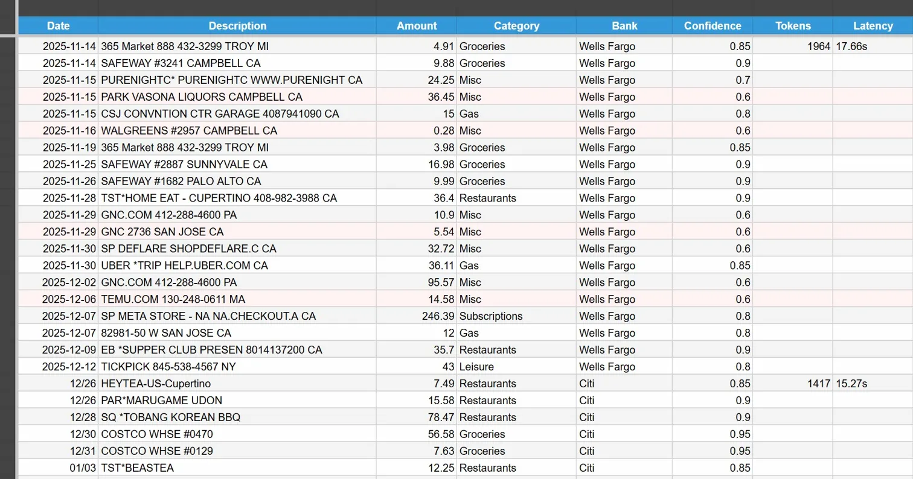
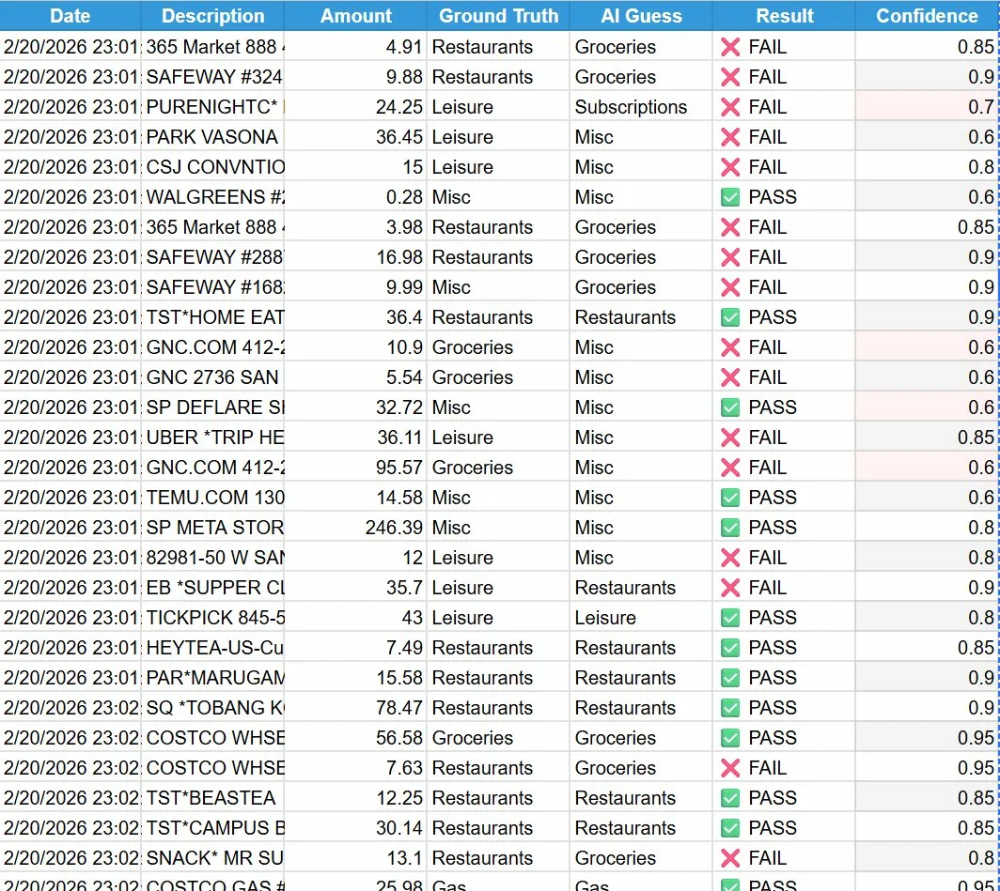

# MET-Universal 

> A cost-optimized, multimodal AI pipeline for extracting structured financial data from bank PDFs using Gemini 2.0 Flash.

Built in Google Apps Script and managed via CLASP, MET-Universal automatically ingests bank statement PDFs, extracts transactions using vision AI, auto-categorizes them with confidence scoring, and writes clean structured data into Google Sheets — across any bank format.

---

## How It Works

Drop a PDF into the `MET_Drop_Zone` Google Drive folder, open the sheet, and hit **Process All Pending PDFs** from the custom menu. The pipeline handles the rest:

1. **Pre-processing** — The PDF is trimmed to remove cover pages and boilerplate, reducing token usage before the API call
2. **AI Extraction** — Gemini 2.0 Flash reads the trimmed PDF and returns a structured JSON array of transactions with date, description, amount, category, bank, and confidence score
3. **Output** — Transactions are written to the active monthly sheet with latency and token counts logged per batch
4. **Archiving** — Processed PDFs are automatically moved to `MET_Archive` to keep the Drop Zone clean

---

## Main Transaction Sheet



Each row captures a full transaction record. Token count and latency are logged on the first row of each batch, making cost and performance visible at a glance. Rows flagged in red indicate low-confidence categorizations (below 0.8 threshold) for quick human review.

---

## Token Optimization

Gemini's multimodal API charges per token — and bank statement PDFs are noisy. MET-Universal applies two optimizations before every API call:

- **PDF Trimming** — Cover pages and summary sections are stripped using page-range extraction, sending only transaction-dense pages to the model
- **Low Resolution Mode** — `MEDIA_RESOLUTION_LOW` is set in the generation config, reducing image token cost while preserving text legibility
- **Model Selection** — Gemini 2.0 Flash is used over Pro for its superior cost-to-performance ratio on structured extraction tasks

These are controlled by a `ENABLE_SLICING` feature flag in `Vision.js`, making it easy to toggle off for baseline performance comparisons.

---

## QA & Accuracy Evaluation Framework

The most technically significant part of this project is its built-in accuracy measurement system — designed around QA engineering principles.

### The Auto-Grader (`QA_Grader.js`)

A ground-truth evaluation framework that tests Gemini's categorization accuracy against a hand-labeled dataset of real transactions.

**How it works:**
1. A `Ground_Truth` tab stores manually verified transactions: description, amount, and correct category
2. The Auto-Grader iterates through each entry and calls Gemini independently for a category prediction
3. Results are compared (case-normalized) against ground truth and logged to the `QA_Dashboard` tab with a PASS/FAIL result and Gemini's confidence score

### QA Dashboard



### Baseline Evaluation Results

Running the grader against **63 real transactions** from two banks (Wells Fargo and Citi) produced a baseline accuracy of **47.6% (30/63 passing)**.

Rather than a failure, this result revealed a clear and actionable pattern: **Gemini was not randomly wrong — it was systematically overconfident on personal categorization rules it had no way to know.**

Key findings:

| Failure Pattern | Example | Gemini Confidence | Actual Label |
|---|---|---|---|
| Small grocery store runs | Safeway $9.88 | 0.90 | Restaurants (snack) |
| Small Costco purchases | Costco Whse $7.63 | 0.95 | Restaurants (food court) |
| Uber trips | Uber *Trip $36.11 | 0.85 | Leisure |
| Streaming services | YouTube Videos $3.99 | 0.90 | Leisure |
| Tesla charges | TESLA $29.16 | 0.70 | Misc (not Gas) |

The model applied conventional category logic with high confidence — but personal spending rules (small Safeway = snack run = Restaurants, not Groceries) are invisible to the model without explicit context. This motivates the roadmap toward personalized prompt learning.

Also notable: several low-confidence passes (e.g., TickPick at 0.6) showed the confidence score is not yet well-calibrated — making the planned confidence vs. accuracy correlation analysis a meaningful next step.

### Regression Suite (`Regression_Tests.js`)

A foundational regression suite with an `assert`-style framework that validates pipeline behavior:

- **TC-01** — PDF trimmer safe fallback: verifies the trimmer returns a valid blob instead of crashing on small or malformed files
- **TC-02** — Negative constraint adherence: verifies that AUTOPAY transactions are never present in Gemini's output, catching prompt regressions

```
 STARTING AUTOMATED REGRESSION SUITE...
 PASS: TC-01: Trimmer returned a valid Blob instead of crashing
 FAIL: TC-02: Output contains forbidden AUTOPAY transactions
 Results: 1 / 2 Passed.
 STATUS: DEPLOYMENT HALTED. Fix failing tests.
```

---

## Project Structure

```
MET-Universal/
├── Vision.js          # Core pipeline: PDF trimming, Gemini API call, sheet output
├── QA_Grader.js       # Auto-grader: ground truth comparison and QA Dashboard logging
├── Regression_Tests.js # Regression suite with assert framework
├── Drive.js           # File management: Drop Zone, archiving, batch processing
├── UI.js              # Custom menu, sheet templating, styling
├── Code.js            # Setup and monthly sheet creation
└── sync.sh            # CLASP pull + git commit/push automation
```

---

## Setup

1. Clone this repo and install CLASP: `npm install -g @google/clasp`
2. Authenticate: `clasp login`
3. Link to your Apps Script project via `.clasp.json`
4. Push code: `clasp push`
5. In the Google Sheet, run **System Admin → Run Initial Setup** to create the Drive folder structure
6. Add your Gemini API key to Script Properties as `GEMINI_API_KEY`
7. Drop a bank PDF into `MET_Drop_Zone` and select **Process All Pending PDFs**

---

## Sync Workflow

`sync.sh` automates the pull-commit-push loop:

```bash
./sync.sh
# Pulls latest from Apps Script, shows git status, prompts for commit message
```

---

## Future Roadmap

1. **Amount-Aware Categorization** — Use amount alongside description for smarter rules (e.g., Costco $7 = food court, Costco $180 = groceries)
2. **Personalized Category Learning** — Refine prompts from human corrections over time, building user-specific spending rules into the system
3. **Confidence vs. Accuracy Analysis** — Cross-reference QA Grader results with confidence scores to identify overconfident failures and underconfident passes
4. **Prompt Performance Tracking** — Version-controlled prompt evaluation to measure accuracy improvement across iterations
5. **Explainability Layer** — AI-side reasoning ("why did I choose Restaurants?") paired with human annotations ("personal rule: small Safeway = snack"), creating a feedback loop for prompt improvement
6. **Date-Based Transaction Browsing** — Sort and filter by date to help identify mystery transactions by jogging memory from spending history
